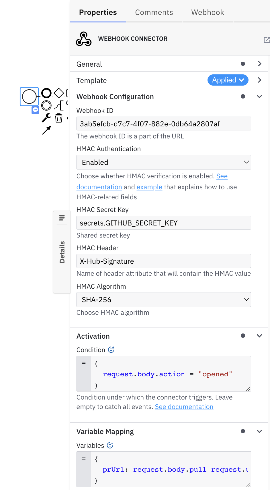
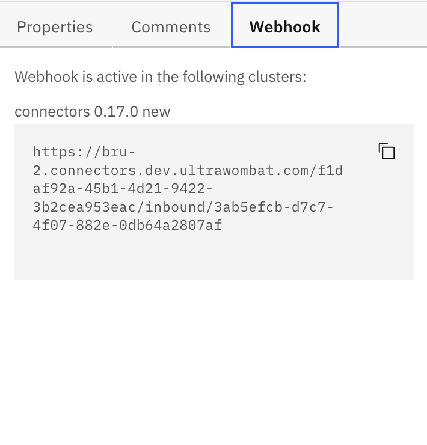

The **HTTP Webhook Connector** allows you to start a BPMN process instance triggered by external HTTP call.

:::note
If you have used the HTTP Webhook Connector with a self-managed Camunda 8 configuration before the
Connector SDK [0.7.0 release](https://github.com/camunda/connector-sdk/releases/tag/0.7.0), you might need to manually replace the element template.
Please refer to the [update guide](../../../../guides/update-guide/connectors/060-to-070) for more details.
:::

## Create an HTTP Webhook Connector task

1. Start building your BPMN diagram with a **Start Event** building block.
2. Change its template to an HTTP Webhook.
3. Fill in all required properties.
4. Complete your BPMN diagram.
5. Deploy the diagram to activate the webhook.
6. Navigate to the **Webhooks** tab in the properties panel to see the webhook URL.

## Make your HTTP Webhook Connector executable

1. In the **Webhook Configuration** section, configure the **Webhook ID**. By default, **Webhook ID** is pre-filled with a random value. This value will be part of the Webhook URL. You will find more details about HTTP Webhook URLs [below](#activate-the-http-webhook-connector-by-deploying-your-diagram).
2. (Optional) Configure [HMAC authentication](https://en.wikipedia.org/wiki/HMAC) if required. **Not recommended:** leave it `disabled` to ignore HMAC verification if your use case doesn't require verification or your use case is not yet supported.

- Set the HMAC shared secret key which is used to calculate the message hash. The value is defined by a webhook administrator.
- Set the HMAC header whose value contains an encrypted hash message. The exact value is provided by the external caller.
- Select HMAC hash algorithm. The exact value is provided by the external caller.

3. Configure **Activation Condition**. For example, given external caller triggers a webhook endpoint with the body `{"id": 1, "status": "OK"}`, the **Activation Condition** value might look like `=(request.body.status = "OK")`. Leave this field empty to trigger your webhook every time.
4. Configure **Variable Mapping**. For example, given external caller triggers a webhook endpoint with the body `{"id": 1, "status": "OK"}` and you would like to extract `id` as a process variable `myDocumentId`. In that case, the **Variable Mapping** might look as `={myDocumentId: request.body.id}`.

## Activate the HTTP Webhook Connector by deploying your diagram

Once you click the **Deploy** button, your HTTP Webhook will be activated and publicly available.

URLs of the exposed HTTP Webhooks adhere to the following pattern:

`http(s)://<base URL>/inbound/<webhook ID>>`

- `<base URL>` is the URL of Connectors component deployment. When using the Camunda Platform 8 SaaS offering, this will typically contain your cluster region and cluster ID.
- `<webhook ID>` is the ID (path) you configured in the properties of your HTTP Webhook Connector.

If you make changes to your HTTP Webhook Connector configuration, you need to redeploy the BPMN diagram for the changes to take effect.

When you click on the event with HTTP Webhook Connector applied to it, a new **Webhooks** tab will appear in the properties panel.
This tab displays the URL of the HTTP Webhook Connector for every cluster where you have deployed your BPMN diagram.

:::note
The **Webhooks** tab is only supported in Web Modeler as part of the Camunda Platform 8 SaaS offering.
You can still use HTTP Webhook Connector in Desktop Modeler, or with your Camunda Platform 8 Self-Managed.
In that case, HTTP Webhook Connector deployments and URLs will not be displayed in Modeler.
:::

### Example

Give a use-case when you need to configure a GitHub webhook with an **HTTP Webhook Connector** in such a way that: (1) your BPMN process starts on every opened PR, and (2) the PR URL is exposed as a process variable.
Let's say you choose `mySecretKey` as a shared secret passphrase. GitHub [declares](https://docs.github.com/en/developers/webhooks-and-events/webhooks/securing-your-webhooks) that they use `X-Hub-Signature-256` header for `SHA-256` HMAC.
Therefore, you would need to set the following:

1. **Webhook ID**: any unique to your cluster webhook ID. This will generate a URL to trigger your webhook. In example, `myWebhookPath`.
2. **HMAC Authentication**: `enabled`.
3. **HMAC Secret Key**: `mySecretKey` or `secrets.MY_GH_SECRET`.
4. **HMAC Header**: `X-Hub-Signature-256`.
5. **HMAC Algorithm**: `SHA-256`.
6. **Activation Condition**: `=(request.body.action = "opened")`.
7. **Variable Mapping**: `={prUrl: request.body.pull_request.url}`.
8. Click `Deploy`.

:::note
For GitHub, there is a simplified [GitHub Webhook Connector](github-webhook.md).
:::
